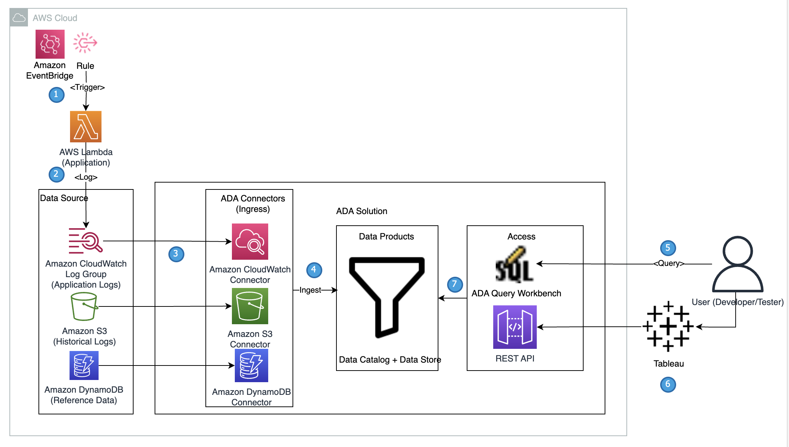
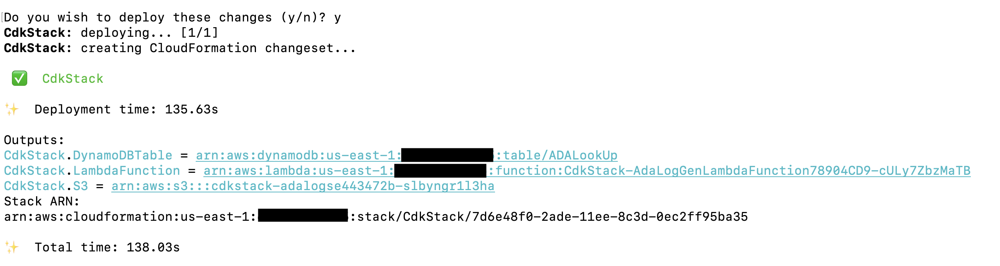
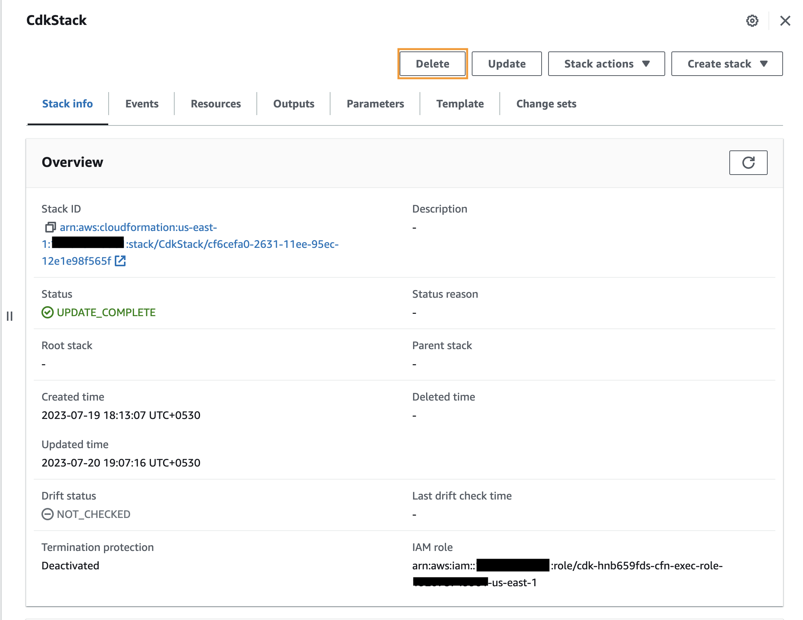

# Derive Application Log Insights Using Amazon CloudWatch Connector for Automated Data Analytics on AWS

## Background
 This repository provides an AWS CDK solution that is used to demonstrate the capabilities of ADA on AWS Solution. [Automated Data Analytics on AWS (ADA)](https://aws.amazon.com/solutions/implementations/automated-data-analytics-on-aws/) is an AWS Solution that enables users to derive meaningful insights from data in a matter of minutes through a simple and intuitive user interface. Using this repository, we will demonstrate how an Application Developer or an Application Tester is able to leverage ADA to derive operational insights of applications running in AWS. ADA’s data products allows users to connect to a wide range of data sources so that users can query the datasets as if they are querying Relational Database Tables.

## Solution overview
Refer to the diagram below to get an overview of the architecture and workflow of using ADA to gain insights into application logs.


## Prerequisites
1. Install the [AWS Command Line Interface](https://aws.amazon.com/cli/)
1. AWS CDK [prerequisites](https://docs.aws.amazon.com/cdk/v2/guide/work-with.html)
1. TypeScript-specific [prerequisites](https://docs.aws.amazon.com/cdk/v2/guide/work-with-cdk-typescript.html)
1. [Git](https://git-scm.com/book/en/v2/Getting-Started-Installing-Git).

## Setting up the Sample Application Infrastructure using AWS CDK
The steps to clone the repo and to set up AWS CDK project are listed below. Before running the commands below, be sure to [configure](https://docs.aws.amazon.com/cli/latest/userguide/cli-chap-configure.html) your AWS Credentials by choosing the North Virginia (us-east-1) region for the deployment. Create a folder, open Terminal and navigate to the folder where the AWS CDK solution needs to be installed.

```
gh repo clone aws-samples/operational-insights-with-automated-data-analytics-on-aws`
npm install
npm run build
cdk synth
cdk deploy
```

These steps perform the following:
1. Clone the sample application project in a local folder
1. Install the library dependencies 
1. Build the project
1. Generate a valid AWS CloudFormation template
1. Deploy the stack using AWS CloudFormation in the user’s AWS account.

The following resources are provisioned in the user’s AWS Account in the North Virginia (us-east-1) region:
1. An Amazon Lambda Function that simulates the logging application and an Amazon EventBridge rule that invokes the Application Amazon Lambda function at a 2-minute interval.
1. An Amazon S3 Bucket with the relevant bucket policies and a .csv file that contains the historical application logs.
1. An Amazon DynamoDB table with the lookup data.
1. Relevant IAM roles and permissions required for the services.

The deployment takes about 1-2 minutes and creates the Amazon DynamoDB lookup table, Application Lambda function and Amazon S3 bucket containing the historical log files as outputs.


## Tear Down
Tearing down the sample application infrastructure is a two-step process. First, to remove the infrastructure provisioned for the purposes of this demo, execute the following command in the Terminal.
```
cdk destroy
```
For the following question, enter ‘y’ and CDK will delete the resources deployed for the demo. 
```
Are you sure you want to delete: CdkStack (y/n)? y
```
Alternatively, the resources can be removed from the AWS Console by navigating the ‘CloudFormation’ service, selecting the ‘CdkStack’ and selecting ‘Delete’ option. 


## Security
See [CONTRIBUTING](CONTRIBUTING.md#security-issue-notifications) for more information.

## License
This library is licensed under the MIT-0 License. See the LICENSE file.